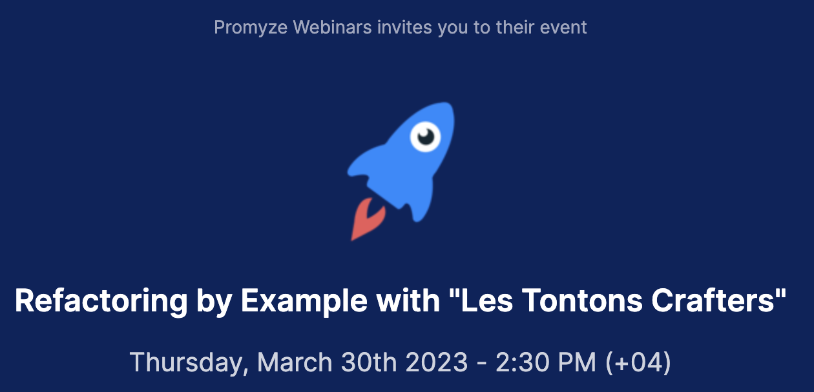

# Order Shipping Kata
Repository used during [Promyze](https://www.promyze.com/) Webinar: "Refactoring by Example".
The step-by-step guide is available through `git log`.

## Pitch
In our industry, we spend time investigating problems that people have already solved in the past. We've been there, too; finding reliable information is indeed challenging.

During this webinar, we propose showing you practices and insights through a Code Review. We'll work in an OOP language on a codebase you may be familiar with.

The webinar will be a live-coding session where we'll refactor code to improve its readability and maintainability. We will rely on a knowledge base and Promyze to identify areas for improvement.

Everything shown will be applicable during your daily duties on existing codebases.

Guillaume Faas and Yoan Thirion are "Les Tontons Crafters", two passionate software crafters keen to share their knowledge and experiences with the community.

## [1) Fight Primitive Obsession](https://xtrem-tdd.netlify.app/Flavours/no-primitive-types)
- Remove unused parameter clientId (automated by IDE)
- Remove redundant else (automated by IDE)
- Create value object CreateOrderItem instead of <string, int> (Primitive obsession)

## [2) Tell Don't Ask](https://xtrem-tdd.netlify.app/Flavours/tell-dont-ask)
- Move Order Creation to Factory Method
- Move logic from Factory method to constructor
- Prepare OrderItem logic refactoring by extracting logic from UseCase in a mapping method
- Extract OrderItem Factory method
- Move factory logic to OrderItem constructor
- Move Product calculation to Product
- Move CreateOrderItem to Commands NS
- Move AddItem logic to Order
- Move for loop in Order
- Move OrderItem Factory logic

## [3) No for loops](https://xtrem-tdd.netlify.app/Flavours/no-for-loops)
- Use ForEach method from LinQ
- Decompose LinQ for better understanding
- Use Aggregate to simplify our code. Simplify?

## [4) Avoid exceptions -> T.D.D and monad](https://xtrem-tdd.netlify.app/Flavours/monads)
- Express new expectation from UseCase with a failing test
- Make it green as fast as possible
- Refactor: move Exception to Domain
- Refactor: create a NewWithEither Factory method on Order
- Refactor: NewWithEither to use the one from OrderItem
- Refactor: Simplify Order code
- Clean up: remove all the methods that do not use Either
- No more exceptions -> only DomainError
- Use immutable Seq in Order

## Replay
Replay will be available soon on Youtube.